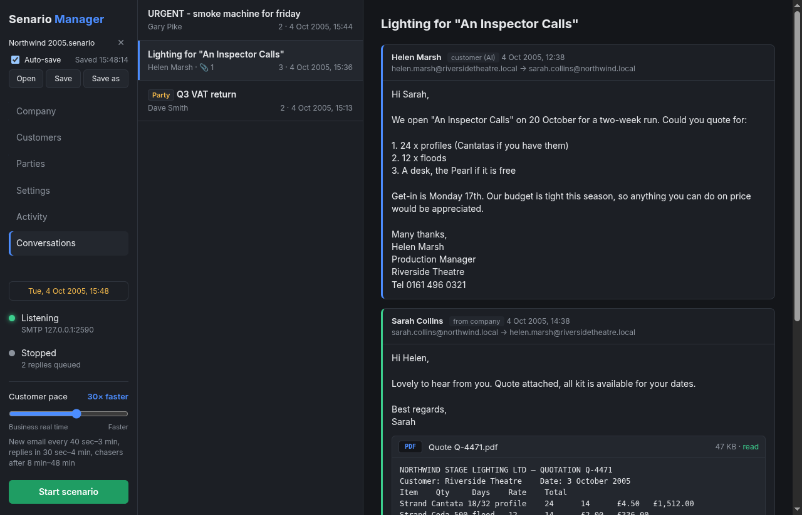
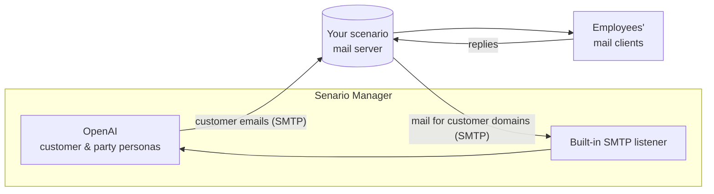
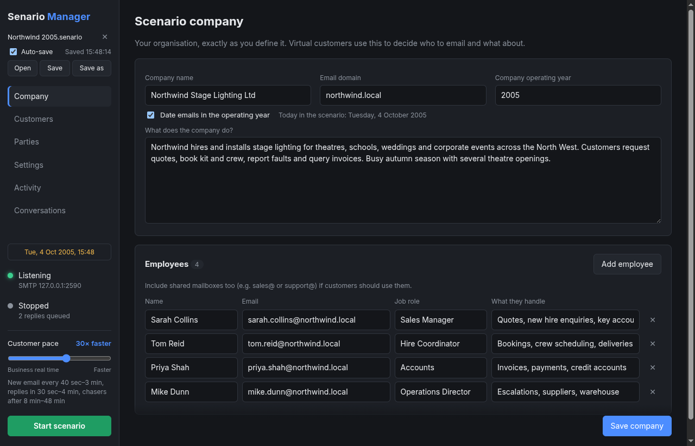
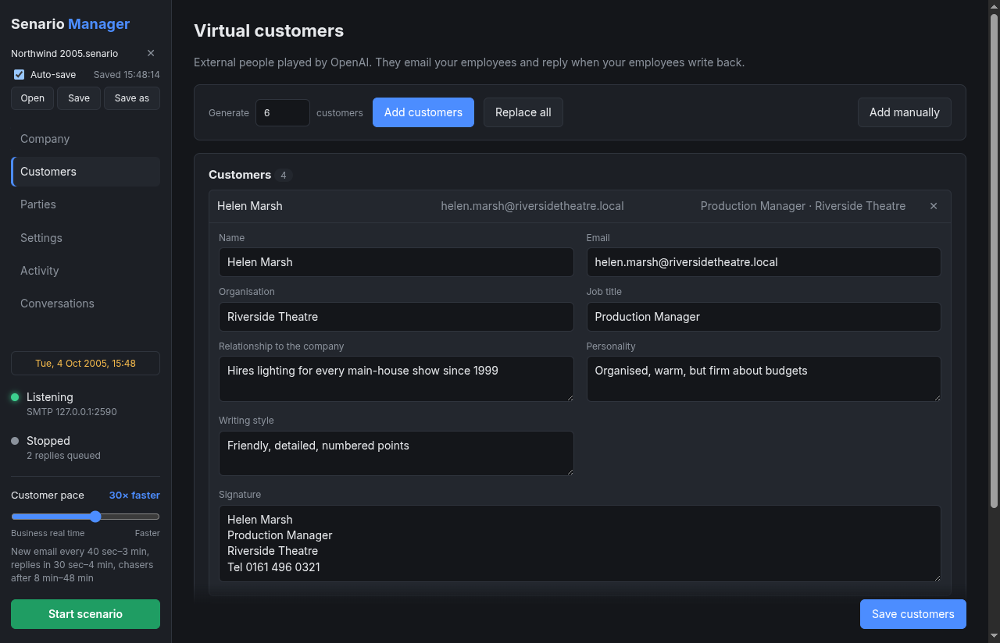
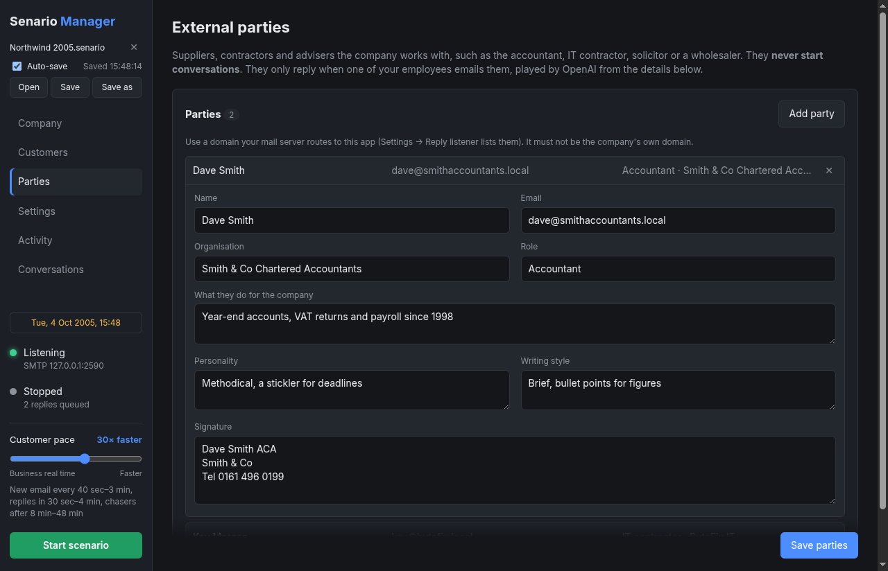
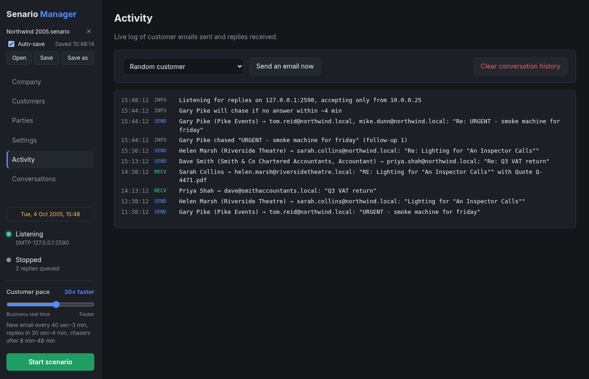

<p align="center">
  
</p>

<h1 align="center">Senario Manager</h1>

<p align="center">
  Bring a training or test network to life with believable email traffic.<br>
  AI-played customers and suppliers email your scenario company and hold real conversations with the people working in it.
</p>

<p align="center">
  <a href="https://github.com/YOUR-USER/senario-manager/releases/latest">Download</a> ·
  <a href="docs/user-guide.md">User guide</a> ·
  <a href="docs/mail-server-setup.md">Mail server setup</a> ·
  <a href="docs/troubleshooting.md">Troubleshooting</a>
</p>



## What it does

You describe a fictional company (what it does and who works there), point Senario Manager at
the company's mail server, and it plays the outside world:

- **Customers** email your employees at realistic intervals about orders, quotes, complaints,
  invoices, deliveries and more. Each one picks the right person based on their job role.
- **Replies get answered.** When an employee replies, the customer writes back in the same
  thread, consistent with everything said so far, until the conversation naturally ends.
- **Attachments are read.** Send a customer a PDF quote, Word document or Excel spreadsheet
  and they'll respond to the actual prices, line items and dates.
- **External parties** such as your accountant, IT contractor or suppliers answer when your
  employees email them, but never start conversations themselves.
- **Unanswered emails get chased:** a polite nudge first, then firmer, then escalation to a manager.
- **Any era:** set the company's operating year (e.g. 2005) and dates, technology, prices and
  events all fit that year.

It's built for cyber ranges, SOC and incident-response exercises, help-desk and admin
training, mail-server testing, and anywhere an empty mailbox gives the game away.

## How it works



- Outbound mail goes **only** to the one mail server you configure, and only to addresses on the
  company's domain.
- Replies come back to a small SMTP listener inside the app, which accepts connections **only**
  from that mail server.
- No IMAP, no mailbox passwords, no agents on the network. Your mail server just routes the
  customer domains to the app. ([Setup guide](docs/mail-server-setup.md))

## Screenshots

| | |
|---|---|
|  **Company:** your organisation, employees and operating year |  **Customers:** AI-generated, fully editable |
|  **Parties:** suppliers and contractors you define |  **Activity:** live log of everything sent and received |

## Quick start

1. **Install:** download the installer for your OS from
   [Releases](https://github.com/YOUR-USER/senario-manager/releases/latest)
   ([installation notes](docs/installation.md)), or run from source:
   ```bash
   git clone https://github.com/YOUR-USER/senario-manager.git
   cd senario-manager
   npm install
   npm start
   ```
2. **Company tab:** enter the company name, email domain, a description of what it does and
   every employee with their role. Save.
3. **Settings:** add your OpenAI API key, the mail server's address, and check the listener port
   (25 by default).
4. **Customers tab:** generate a set of customers. Optionally add suppliers on the **Parties** tab.
5. **Mail server:** route the customer domains (listed under Settings → Reply listener) to this
   machine. See the [mail server setup guide](docs/mail-server-setup.md).
6. Click **Start scenario**, then watch **Activity** and **Conversations**.

Use the **pace slider** to run in real business time or up to 360× faster, and **Save** the
whole scenario to a `.senario` file to reuse or share it.

## Requirements

- Windows 10/11, macOS 12 (Monterey) or later, or Linux (x64; Windows and macOS also on ARM).
- An [OpenAI API key](https://platform.openai.com/api-keys). The default model is
  `gpt-4.1-mini`; any chat model that supports JSON output works, and one that accepts images
  is needed to read image attachments.
- A mail server on the scenario network that can route selected domains to another host.
- To build from source: Node.js 24+.

## Documentation

| Guide | Covers |
|---|---|
| [Installation](docs/installation.md) | Installing on Windows, macOS and Linux, first-run warnings, port 25 |
| [User guide](docs/user-guide.md) | Every tab and feature, step by step |
| [Mail server setup](docs/mail-server-setup.md) | Routing customer domains (Postfix, Exchange, hMailServer, Exim, others), firewalls, testing |
| [Settings reference](docs/configuration.md) | Every setting and its default |
| [`.senario` files](docs/senario-file-format.md) | Saving, auto-save and the SQLite file format |
| [Troubleshooting](docs/troubleshooting.md) | Common problems and fixes |
| [Architecture](docs/architecture.md) | How the code fits together, for contributors |
| [Building](docs/building.md) | Building installers, CI, code signing |

## Responsible use

Senario Manager is meant for **isolated scenario, lab and training networks that you control**.
Its design keeps traffic there: it sends to exactly one configured mail server, only to the
scenario company's own domain, and accepts replies only from that server. Generated customer
domains use a fictional TLD (`.local` by default) so they can't collide with real organisations.

Don't use it to send mail to real people or real organisations, or anywhere the recipients
don't know it's a simulation. Please read [SECURITY.md](SECURITY.md) for how to report
vulnerabilities.

## Contributing

Bug reports, ideas and pull requests are welcome. See [CONTRIBUTING.md](CONTRIBUTING.md).
`npm test` runs the full test suite.

## License

Copyright © 2026 John Hart.

Senario Manager is free software: you can redistribute it and/or modify it under the terms of
the [GNU General Public License v3.0](LICENSE). It comes with no warranty. Bundled third-party
components keep their own licenses. See [third-party licenses](docs/third-party-licenses.md).
