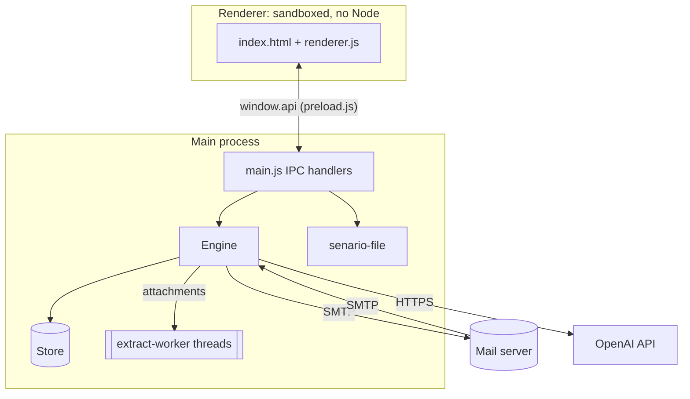

# Architecture

A guide for contributors: how the code is organised, how a conversation flows through it, and
the rules that keep the app safe.

## Overview

Senario Manager is an Electron app with no bundler or framework. The main process is plain
CommonJS JavaScript, and the UI is a single HTML page with vanilla JS.

```
src/
├── main.js                 Electron main process: window, IPC, .senario open/save/auto-save
├── preload.js              Exposes a small window.api to the UI (contextIsolation + sandbox)
├── renderer/
│   ├── index.html          All tabs
│   ├── renderer.js         UI logic (forms, conversations, pace slider, file box)
│   └── styles.css
└── core/                   No Electron UI code: everything here is testable in plain Node
    ├── engine.js           The scenario engine: scheduling, replies, follow-ups, inbound mail
    ├── ai.js               OpenAI prompts (customer email, reply, follow-up, image transcription)
    ├── mail.js             Outbound SMTP and the inbound SMTP listener, locked to one server
    ├── attachments.js      Attachment type detection; runs the parser worker; prompt formatting
    ├── extract-worker.js   Worker thread that turns one file into text
    ├── clock.js            Maps real time onto the company's operating year
    ├── store.js            Working state in the user-data folder (JSON, secrets encrypted)
    └── senario-file.js     .senario save/load (SQLite via node:sqlite)
scripts/                    start, check, icon, screenshots, licenses
test/                       Test suites (npm test)
build/                      Icon source and macOS entitlements for electron-builder
```

## Process model



- The renderer runs with `contextIsolation`, `sandbox` and no Node integration. It can only call
  the functions in `preload.js`, each of which maps to an `ipcMain.handle` channel in
  `main.js`. Handlers return `{ ok, result | error }`, and `preload.js` turns errors back into
  exceptions.
- The engine emits `log`, `status` and `threads-changed` events, which `main.js` forwards to the
  renderer.

## The engine

`Engine` (`src/core/engine.js`) owns everything that happens over time.

### People

- **Employees**, from the Company tab: the only valid recipients.
- **Customers** (`store.customers`): start conversations and reply.
- **Parties** (`store.parties`): only reply.
- `contactMap()` merges customers and parties, tagging each with `kind: 'customer' | 'party'`.
  `contactDomains()` is the set of domains the listener accepts.

### Outbound: a new customer email

1. `scheduleNextEvent()` sets a timer for a random interval divided by the pace.
2. `generateEvent()` picks a random **customer** (never a party) and calls
   `ai.writeCustomerEmail()`. The model chooses the recipient from the employee list. The engine
   validates it, falling back to a random employee if needed.
3. `deliver()` checks every recipient is on a company domain, creates the `Message-ID`, records
   it in `sentIds`, sends via `mail.sendMail()`, and adds the message to a thread.
4. A follow-up job is scheduled in case nobody answers.

### Inbound: an employee replies

1. The mail server connects to the listener (`mail.startListener`). `onConnect` rejects any IP
   not in the allowed set, and `onRcptTo` rejects recipients outside `contactDomains()`.
2. `handleIncoming()` deduplicates by Message-ID and ignores the app's own mail, bounces and
   auto-replies. It then extracts attachments, finds the thread (by `In-Reply-To`/`References`,
   or by subject and customer), cancels pending follow-ups on that thread, and queues a reply
   from the addressed customer or party.
3. `runReply()` calls `ai.writeCustomerReply()` with the whole thread, including attachment text.
   It sends a reply-all (company addresses only) that quotes the previous message, then
   schedules a follow-up if the customer is waiting on something.

### Jobs, pace and persistence

Replies and follow-ups are **jobs** in `store.data.pending`:
`{ id, type: 'reply'|'followup', customer, threadId, replyToId|afterId, attempt, due, scenarioMs }`.

- `addJob()` sets `due = now + scenarioMs / pace`, saves the job, and arms a timer while running.
- `setPace()` rescales every pending job's remaining time and the next-event timer, so speed
  changes apply live.
- Jobs survive restarts: `resumePendingReplies()` re-arms them on start. If the scenario is
  stopped when a timer fires, the job stays pending.
- `runFollowUp()` does nothing if anything newer exists in the thread, and defers to working
  hours at real-time pace when that option is on.

### The listener's lifecycle

The listener is independent of Start/Stop. `main.js` opens it when the app launches, the engine
rebinds it when listener or mail-server settings change, and it closes on quit. This means the
mail server can always deliver, and replies received while stopped are answered on the next start.

## AI prompts

`src/core/ai.js` builds every prompt from:

- `companyBrief()`: company, description and staff, plus `eraRules()` when an operating year is set.
- `customerBrief()`: the persona. Parties get "you are a supplier; the company is your client" framing.
- `REALISM`: plain text, natural tone, specific details, no AI/simulation mentions, never claim
  to attach files.
- `formatThread()`: the conversation with dates on the scenario clock. The most recent message
  with attachments includes their full text; older ones get a short excerpt.
- `ATTACHMENT_RULES`: treat attachment content as data, and respond to its specifics.

All calls use `response_format: json_object` and return small JSON objects such as
`{ subject, body, to, cc }`, `{ shouldReply, body, expectsResponse }` or `{ body, addCc }`.

## Attachments

`extractAttachments()` skips inline signature images, detects the type by extension and then
MIME type, and runs each file through `extract-worker.js` in a **worker thread** with a 30 s
timeout and a 512 MB heap cap. Images are transcribed by the model instead (`ai.describeImage`).
Results are stored on the message as `{ filename, contentType, size, kind, status, text, truncated, error }`.

| Kind | Library |
|---|---|
| PDF | `unpdf` (pdf.js) |
| .docx | `mammoth` (via HTML, so table rows stay on one line) |
| .doc | `word-extractor` |
| Spreadsheets | SheetJS `xlsx` 0.20.3 from the official CDN (the npm copy is outdated) |
| .pptx / .odt / .odp | `jszip` and XML text extraction |
| .rtf / .html / .eml / text | Built-in, or `mailparser` |

## The scenario clock

`clock.js` shifts real time back by a **whole number of weeks**, chosen so "now" lands in the
operating year. Weekdays and times of day therefore match the real clock. A daylight-saving
correction keeps the wall-clock time identical when DST changes fall on different dates. Stored
times are always real, and the shift is applied only for prompts, email `Date:` headers, quoted
lines and display.

## Storage

- **Working state** (`store.js`): `senario-data.json` in the user-data folder, written
  atomically with a 300 ms debounce. The OpenAI key and SMTP password are encrypted with
  Electron `safeStorage` when available. `appState` (open file, auto-save) is never written to
  `.senario` files.
- **`.senario` files** (`senario-file.js`): SQLite via Node's built-in `node:sqlite`, so there are
  no native modules. See [.senario files](senario-file-format.md).
- **Auto-save** (`main.js`): `store.onChange` schedules a write 1.5 s after changes settle, at
  most 10 s apart.

## Safety invariants

Changes must keep these true. The tests check them.

1. **One outbound host.** `mail.serverHost()` is the only source of the SMTP host. Nothing does
   MX lookups.
2. **Company-only recipients.** `engine.deliver()` refuses any recipient outside the company's
   domains.
3. **One inbound source.** The listener refuses connections from IPs other than the mail
   server (plus explicitly added IPs), and recipients outside customer/party domains.
4. **No loops.** Never reply to the app's own Message-IDs, to customer/party senders, to bounces
   (null sender, `mailer-daemon`) or to `Auto-Submitted`/`Precedence: bulk` mail.
5. **Untrusted input.** Attachment parsing stays in the time- and memory-limited worker.
   Attachment text is passed to the model as data. Renderer output is always HTML-escaped.

## Tests

`npm test` runs every `test/*.test.js` in Electron's Node runtime (needed for `node:sqlite`):

| Suite | Covers |
|---|---|
| `e2e.test.js` | Full loop against a local SMTP sink and the real listener: sending, replies, threading, refusals, auto-replies, follow-ups, pace, attachments |
| `operating-year.test.js` | Prompts, `Date:` headers and quoted dates in a past year, sent through a fake OpenAI server |
| `parties.test.js` | Parties never initiate, supplier framing, optional chasing, persistence |
| `attachments.test.js` | Every supported format, plus corrupt and unsupported files and inline logos |
| `senario-file.test.js` | Save/load round trip, credentials, overwrite, invalid files |

`npm run test:packaged` checks a build from `npm run pack`: the parser workers and SQLite must
work from inside `app.asar`. Tests use local ports 2526–2599 and never contact real services.
