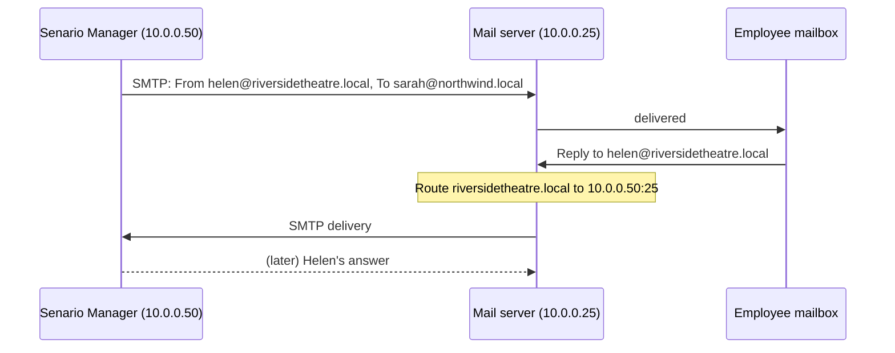

# Mail server setup

Senario Manager talks to your scenario's mail server in two directions. Both use plain SMTP:

| Direction | What happens | What you configure |
|---|---|---|
| **In** to the company | The app submits customer emails to the mail server, addressed to employees. | Nothing special: it's ordinary inbound mail. |
| **Out** of the company | When employees reply, the mail server must deliver mail for the *customer domains* to the app. | A **route** (also called transport, smart host or send connector) per customer domain, pointing at the app's IP and port. |



The examples below use **10.0.0.25** for the mail server and **10.0.0.50** for the machine
running Senario Manager. Replace them with your own addresses.

## 1. Find out what to route

Open **Settings → Reply listener**. The box at the bottom lists every customer and external-party
domain, and the address to route it to, for example:

```
riversidetheatre.local  →  10.0.0.50:25
pikeevents.local        →  10.0.0.50:25
smithaccountants.local  →  10.0.0.50:25
```

Add a route for each one. If you add customers or parties later, add routes for any new domains.

> **Don't route the whole TLD** (e.g. all of `.local`) if the company's own domain is under it
> too, or the company's internal mail would be sent to the app.

## 2. Add the routes

### Postfix

`/etc/postfix/transport`:

```
riversidetheatre.local   smtp:[10.0.0.50]:25
pikeevents.local         smtp:[10.0.0.50]:25
smithaccountants.local   smtp:[10.0.0.50]:25
```

The square brackets stop Postfix looking up MX records. Then:

```bash
sudo postmap /etc/postfix/transport
sudo postconf -e 'transport_maps = hash:/etc/postfix/transport'
sudo postfix reload
```

### Exim (including Debian/Ubuntu exim4)

Add a router **before** the `dnslookup` router (on Debian with split config, e.g.
`/etc/exim4/conf.d/router/150_exim4-config_senario`):

```
senario_customers:
  driver = manualroute
  domains = riversidetheatre.local : pikeevents.local : smithaccountants.local
  transport = remote_smtp
  route_list = * 10.0.0.50
  no_more
```

Then `sudo update-exim4.conf && sudo systemctl restart exim4`.

### Microsoft Exchange 2010 / 2013 / 2016 / 2019 / SE

Create a send connector for the customer domains with the app as its smart host (Exchange
Management Shell):

```powershell
New-SendConnector -Name "Senario customers" -Usage Custom `
  -AddressSpaces "SMTP:riversidetheatre.local;1","SMTP:pikeevents.local;1","SMTP:smithaccountants.local;1" `
  -DNSRoutingEnabled $false -SmartHosts "10.0.0.50" -SmartHostAuthMechanism None `
  -Port 25 -SourceTransportServers "<your-exchange-server>"
```

To add a domain later:

```powershell
$c = Get-SendConnector "Senario customers"
Set-SendConnector $c -AddressSpaces ($c.AddressSpaces + "SMTP:newcustomer.local;1")
```

Customer emails arrive anonymously, which the default Frontend receive connector accepts for
accepted domains. In the EAC the equivalent is **Mail flow → Send connectors → +**, choose
*Custom*, *Route mail through smart hosts*, add the address spaces, and set the smart host.

### Microsoft Exchange 2003 / 2007

These are useful for period scenarios.

- **Exchange 2003:** in *Exchange System Manager*, go to **Routing Groups → (group) →
  Connectors → New → SMTP Connector**.
  - **General:** *Forward all mail through this connector to the following smart hosts*, and enter
    `[10.0.0.50]` (the brackets mean an IP address). Add your bridgehead server.
  - **Address Space:** add an SMTP entry for each customer domain.
- **Exchange 2007:** use the `New-SendConnector` command above, or **Organization
  Configuration → Hub Transport → Send Connectors**.

### hMailServer

**Settings → Advanced → Routes → Add**, one per customer domain:

- **Domain:** `riversidetheatre.local`
- **Target SMTP host:** `10.0.0.50`, **TCP/IP port:** `25`
- **Addresses:** *Deliver to all addresses*

### Other servers

Look for *routes*, *smart host per domain*, *transport rules*, *relay host* or *static routes*.
You need: "for recipient domain X, deliver by SMTP to 10.0.0.50 port 25, without DNS/MX
lookup". This exists in MDaemon (*Domain gateways*), Kerio Connect (*SMTP delivery → relay
rules*), Zimbra (`zimbraMtaTransportMaps` via Postfix), Sendmail (`mailertable`) and most
others.

## 3. Let the app's mail in

Customer emails arrive from the app's IP with sender domains that have no DNS, no SPF and no
DKIM. On a scenario network you'll usually want to:

- **Whitelist the app's IP** in any spam filter, RBL checks, greylisting, SPF/DMARC
  enforcement, or "sender domain must resolve" rules. Greylisting in particular delays every
  first email by minutes.
- **Allow anonymous inbound SMTP** for the company's own domains from the app's IP (normally
  already the default).
- If your server insists on authentication even for inbound mail, tick **Settings → Scenario mail
  server → Server requires authentication** and give the app an account.

## 4. Firewalls

Two connections must be allowed:

| From | To | Port | Purpose |
|---|---|---|---|
| App (10.0.0.50) | Mail server (10.0.0.25) | 25, or whatever port you set | Customer emails in |
| Mail server (10.0.0.25) | App (10.0.0.50) | 25 (the listener port) | Replies out |

On the app's machine, allow inbound TCP 25 **only from the mail server**. See
[Installation → Firewall](installation.md#firewall) for `ufw`, firewalld and Windows commands.

If the mail server sends from a different address than the one you entered, for example it
has several network cards or sits behind NAT, add that address under **Settings → Reply
listener → Also accept from IPs**. The Activity log tells you exactly which address was refused.

## 5. Test it

1. Start Senario Manager. The sidebar should say **Listening · SMTP 0.0.0.0:25**.
2. **From the mail server**, connect to the app:
   ```bash
   telnet 10.0.0.50 25
   ```
   You should see `220 … ESMTP ready`. Type `QUIT` to leave.

   | What you see | Meaning |
   |---|---|
   | `220 … ESMTP ready` | All good. |
   | `554 5.7.1 Access denied: <ip> is not an allowed mail server` | The app refused that source IP. Add it under *Also accept from IPs* if it's genuinely the mail server. |
   | `Connection refused` / timeout | Firewall, wrong IP, or the app isn't listening. See [Troubleshooting](troubleshooting.md#the-mail-server-cant-connect-to-the-app). |
3. In **Activity**, click **Send an email now**. It should appear in the employee's mailbox.
4. Reply to it from the employee's mail client. Within a few seconds Activity shows a `RECV`
   line, then *"… will reply in …"*.

With [swaks](https://github.com/jetmore/swaks), you can test the route from the mail server
without a mail client:

```bash
swaks --server 10.0.0.25 --from sarah.collins@northwind.local --to helen.marsh@riversidetheatre.local \
      --header "Subject: Route test" --body "Testing the route"
```

## Security notes

- The listener accepts mail **only** from the mail server's IP(s) and **only** for customer and
  party domains. Everything else is refused at the SMTP level.
- The app never connects to anything except the configured mail server (and OpenAI's API).
- Keep the mail server from relaying customer domains to the internet. With the routes above,
  it delivers them to the app instead of looking up real MX records. Using a fictional TLD
  such as `.local` for customer domains means a missing route can't reach a real organisation.
