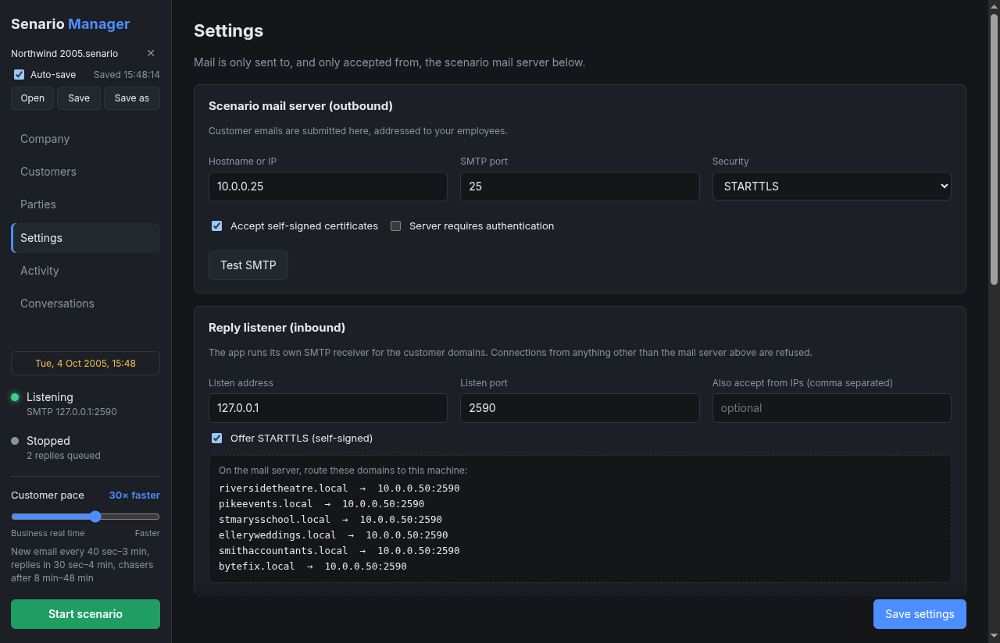

# User guide

This guide walks through Senario Manager tab by tab, then covers the features that cut across
tabs: pace, follow-ups, attachments, the operating year and scenario files.

- [The window](#the-window)
- [Company](#company)
- [Customers](#customers)
- [Parties](#parties)
- [Settings](#settings)
- [Running a scenario](#running-a-scenario)
- [Activity](#activity)
- [Conversations](#conversations)
- [Pace](#pace)
- [Follow-ups](#follow-ups)
- [Attachments](#attachments)
- [Operating year](#operating-year)
- [Saving, opening and auto-save](#saving-opening-and-auto-save)
- [Tips for a convincing scenario](#tips-for-a-convincing-scenario)

## The window

The sidebar is always visible. From top to bottom:

- **File:** the open `.senario` file, auto-save status, and **Open / Save / Save as**.
- **Tabs:** Company, Customers, Parties, Settings, Activity, Conversations.
- **Scenario date:** shown when the company has an [operating year](#operating-year).
- **Listening:** whether the reply listener is up, and on which address and port.
- **Running / Stopped:** the scenario state, the time of the next new email, and how many replies
  and chases are queued.
- **Customer pace:** the [pace slider](#pace).
- **Start / Stop scenario** (green / red).

## Company

Everything about your organisation is defined here by you. The app never invents employees.

| Field | What it's for |
|---|---|
| **Company name** | Used in every AI prompt. |
| **Email domain** | The company's domain, e.g. `northwind.local`. Customers only ever send to this domain. |
| **Company operating year** | Optional. Runs the scenario in a past (or future) year. See [Operating year](#operating-year). |
| **Date emails in the operating year** | Puts the scenario-year date in email `Date:` headers. |
| **What does the company do?** | The single most important input. Customers decide what to email about based on it, so be specific: products, typical customers, current projects, recent problems. |
| **Employees** | Name, email, job role and *what they handle*. Customers choose who to write to from these, so "Invoices, payments, credit accounts" routes billing questions to the right person. |

Add shared mailboxes (`sales@`, `support@`, `accounts@`) as employees too if customers should
use them. Click **Save company** when done.

## Customers

Customers are the people who start conversations. They're played by OpenAI.

- **Add customers** generates the number you choose from your company description, avoiding
  duplicates of existing customers. **Replace all** starts over.
- Each customer has a name, email, organisation, job title, relationship to the company,
  personality, writing style and signature. All of it is editable. Click a customer to expand it.
- **Add manually** creates a blank customer.
- Click **Save customers** after editing.

Customer email domains use the fictional TLD set in **Settings → Scenario behaviour** (`.local`
by default), so they never belong to a real organisation. Each customer domain needs a route
on your mail server. See [Mail server setup](mail-server-setup.md).

> Set the [operating year](#operating-year) *before* generating customers, so their histories
> and signatures fit the period.

## Parties

External parties are suppliers, contractors and advisers the company works with, such as an
accountant, IT contractor, solicitor or wholesaler. Unlike customers:

- **You define them.** Nothing is generated.
- **They never start a conversation.** They're never picked for scheduled emails or *Send an email now*.
- **They reply when an employee emails them**, as a supplier whose client is the company. The
  accountant answers the VAT question with figures, asks for the bank statement they need, and
  stays within their remit.
- They don't chase unanswered questions unless you enable that under **Settings → Follow-ups**.

Fields: name, email, organisation, role, **what they do for the company** (the most important
one), personality, writing style and signature. Party domains need mail-server routes just like
customer domains, and can't be the company's own domain.

## Settings

Settings has five sections:

- **Scenario mail server (outbound):** where customer emails are submitted. Use **Test SMTP** to
  check the connection.
- **Reply listener (inbound):** the app's own SMTP receiver. The box at the bottom lists exactly
  which domains to route to which address. See [Mail server setup](mail-server-setup.md).
- **OpenAI:** API key, model and an optional base URL. Use **Test OpenAI** to check it.
- **Scenario behaviour:** the customer TLD, extra guidance for the AI, timing and working hours.
- **Follow-ups:** chasing unanswered emails.

Every setting is described in the [settings reference](configuration.md). Click **Save settings**
after changes. Changing the listener address or port, or the mail server, restarts the listener
straight away.

### Extra guidance

**Settings → Scenario behaviour → Extra guidance** is free text passed to every customer and
party. Use it to steer the scenario, for example:

- *"A product recall is under way this week; several customers are unhappy about late deliveries."*
- *"Keep emails short; most customers write from their BlackBerry."*
- *"One customer, Gary Pike, is disputing invoice INV-2207."*

## Running a scenario

Click **Start scenario**. The app then:

1. Sends a new customer email after a random interval (*New customer email every … to …*),
   repeating until stopped.
2. Answers every reply from an employee after a random delay (*Customer reply delay*).
3. Chases unanswered emails if [follow-ups](#follow-ups) are on.

Click **Stop scenario** to pause. While stopped:

- **The listener keeps running**, so the mail server can still deliver replies. Replies received
  while stopped are answered once you start again.
- Queued replies and chases are kept, including across app restarts, and resume on the next start.

Quitting the app closes the listener. The app asks you to confirm, because the mail server then
holds replies until the app is back.

## Activity

A live log of everything the app does:

| Level | Meaning |
|---|---|
| `SEND` | A customer or party email was submitted to the mail server. |
| `RECV` | An email from the company arrived at the listener, including attachment names. |
| `INFO` | Scheduling, decisions ("considers the thread finished"), listener status. |
| `ERROR` | Something failed: SMTP, OpenAI, a refused connection, an unreadable attachment. |

**Send an email now** triggers a new customer email immediately, from a random customer or the
one you pick. **Clear conversation history** forgets all threads and queued replies. It doesn't
touch mail already delivered.

The log is kept in the `.senario` file (last 5,000 entries). Times here are always real-world
time.

## Conversations

Every thread, newest first. Threads with external parties are tagged **Party**, and 📎 shows the
number of attachments.

- Blue-edged messages were written by the app (*customer (AI)*). Green-edged messages came from
  the company.
- Attachments are listed under their message with type, size and whether they were read. Click
  one to see exactly what the AI read from it.
- Dates are shown in the scenario's operating year.

Replies are matched to threads by their `In-Reply-To`/`References` headers. If a mail client
drops those, the reply is matched by subject and customer instead.

## Pace

The **Customer pace** slider compresses every delay: new emails, customer replies and chases.

| Position | Effect |
|---|---|
| **Business real time** (1×) | Timings exactly as set in Settings. |
| 2×, 5×, 10×, 30×, 60×, 120× | Everything that many times faster. At 60×, an hour of scenario time passes in a minute. |
| 360× (far right) | An hour passes in 10 seconds. Good for demos and testing. |

The line under the slider shows the effective timings. Changing pace while running rescales
everything already scheduled, so a reply due in an hour at 1× is due in a minute after moving to
60×. Working-hours limits only apply at real-time pace.

## Follow-ups

If nobody answers a customer's email, the customer chases it after a random wait (**Settings →
Follow-ups**, 4–24 hours of scenario time by default, at most 2 chases per email).

1. The first chase is a polite nudge.
2. The second is noticeably firmer and mentions the impact of the delay.
3. Later chases escalate and may copy in another member of staff.

Each chase waits a little longer than the one before. Any reply from the company cancels pending
chases on that thread. Customers don't chase when they aren't waiting for anything, for example
after their own "thanks, all sorted".

## Attachments

When an email from the company has attachments, the app extracts their text and gives it to the
customer or party, who then reacts to the specifics: prices, line items, dates and terms.

| Type | Formats |
|---|---|
| PDF | `.pdf` (text-based; scanned PDFs have no text to read) |
| Word | `.docx`, `.doc` (tables keep one row per line) |
| Spreadsheets | `.xlsx`, `.xls`, `.xlsb`, `.ods`, `.csv` (every sheet) |
| Presentations | `.pptx`, `.odp` |
| Other documents | `.odt`, `.rtf`, `.html`, `.txt`, `.md`, `.json`, `.xml`, `.ics`, `.vcf` |
| Email | Forwarded `.eml` messages |
| Images | `.png`, `.jpg`, `.gif`, `.webp`, transcribed by the OpenAI model (needs a model that accepts images) |

- Signature logos embedded in the email body are ignored.
- If a file can't be read (scanned, corrupt, unsupported or over 25 MB), the customer reacts as a
  real person would, typically by asking for it to be resent.
- Up to 20,000 characters are kept per attachment. The extracted text is kept, not the file.
- Files are parsed in an isolated worker with a 30-second limit, so a malformed file can't stall
  the app.

Customers and parties never send attachments themselves. They put the details in the email body.

## Operating year

Set **Company → Company operating year** (e.g. `2005`) to run the scenario in that year.

- **Scenario clock:** real time is shifted back by whole weeks, so weekdays and times of day
  always match the real clock. Tuesday 6 October 2026, 10:30 becomes Tuesday 4 October 2005,
  10:30. The sidebar shows the current scenario date.
- **Period-correct content:** customers and parties live in that year. Technology (fax,
  landlines, period mobiles), file formats, prices, laws, events and companies must fit it, with
  nothing from later.
- **Email dates:** with *Date emails in the operating year* ticked, `Date:` headers and the
  *"On … wrote:"* lines in replies use the scenario date. Untick it to keep real dates in headers;
  the content still follows the year.
- Leave the field empty for the present day.

> The mail server adds its own `Received:` headers using its own clock, which the app can't
> change. If lab machines' clocks are set to the scenario year too, that's fine: the app records
> when each reply actually arrived, so ordering and delays aren't affected.

## Saving, opening and auto-save

Use **Open / Save / Save as** at the top of the sidebar (**Ctrl+O**, **Ctrl+S**,
**Ctrl+Shift+S**; **⌘** on macOS). A `.senario` file holds everything: settings, company,
customers, parties, conversations, queued replies and chases, and the activity log.

- **Save** first commits whatever is in the forms, so the file matches what's on screen.
- On **Save as** you choose whether to include credentials (OpenAI key and SMTP password). Leave
  them out for files you'll share. Opening a file without credentials keeps the ones already in
  the app.
- **Auto-save:** once a scenario is saved to or opened from a file, every change is written back
  to it: about 1.5 seconds after things go quiet, at least every 10 seconds while busy, and on
  quit. The sidebar shows the last save time, or **Save failed** if, for example, a USB drive was
  removed. The **Auto-save** checkbox turns it off, and **✕** stops using the file.
- Queued replies and chases keep the time they had left, so a loaded scenario resumes where it
  was saved.
- Opening a file asks before replacing the current scenario, and stops it if it's running.
- Double-clicking a `.senario` file opens it in the app (installed builds).

The format is plain SQLite. See [.senario files](senario-file-format.md).

## Tips for a convincing scenario

- **Write a rich company description.** Mention products, prices, current projects, recent
  incidents and the kind of customers you have. The more context, the more specific the emails.
- **Give employees clear "what they handle" entries**, so customers reach the right person.
- **Edit customers' personalities.** One impatient customer, one meticulous one and one chatty one
  make the inbox feel alive.
- **Start at a higher pace** to seed some history, then drop to real time for the exercise.
- **Use extra guidance** to inject events mid-exercise ("a delivery van broke down this morning").
- **Save a clean starting point** as a `.senario` file and reload it to rerun the same exercise.
